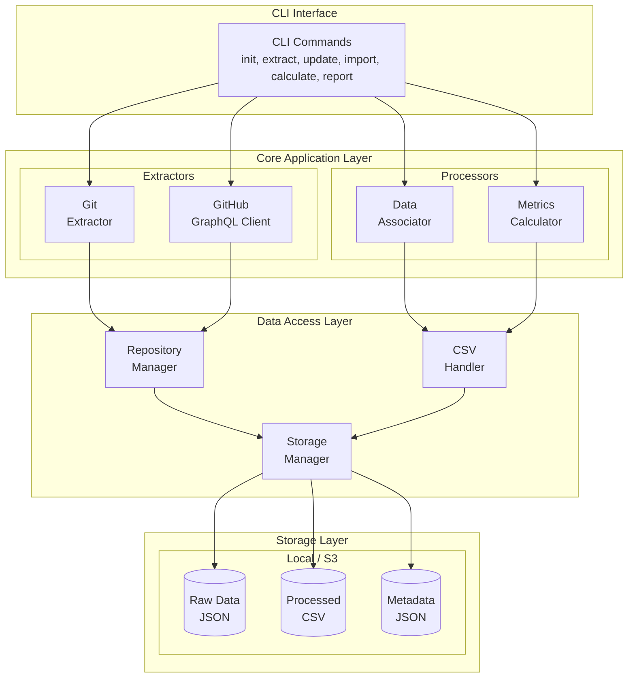
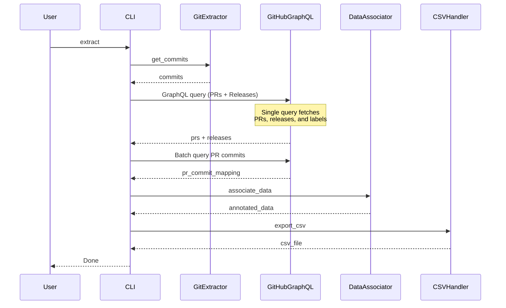
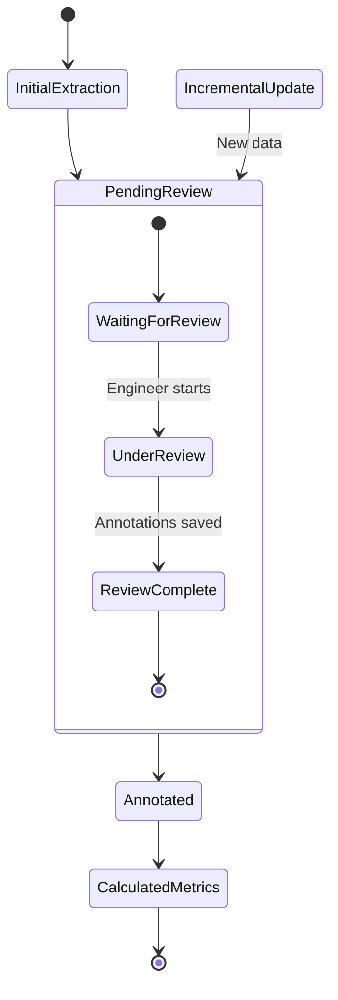
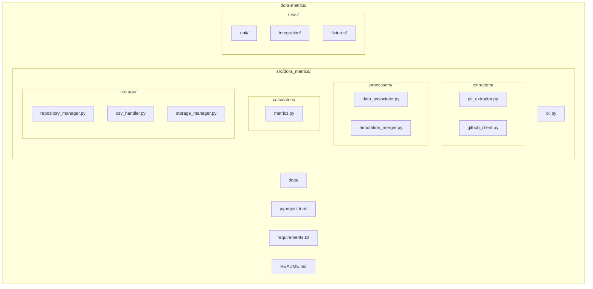
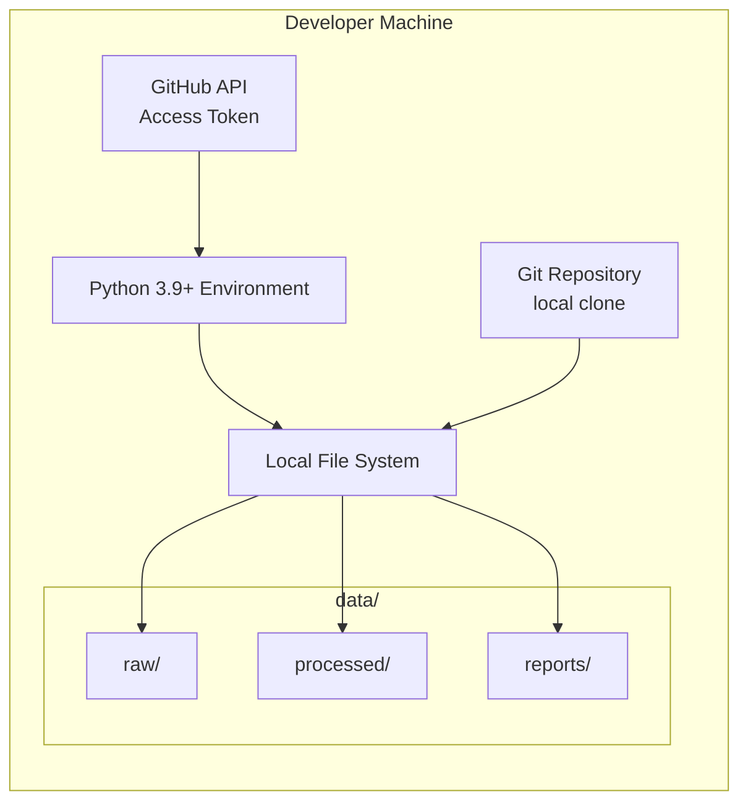
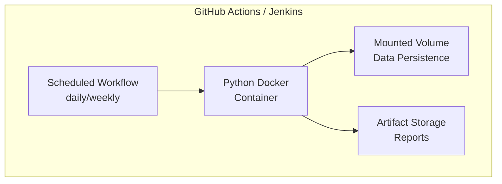
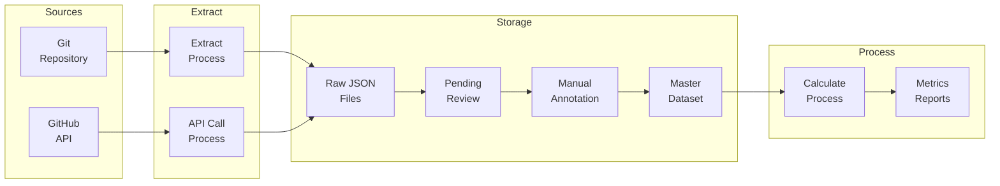
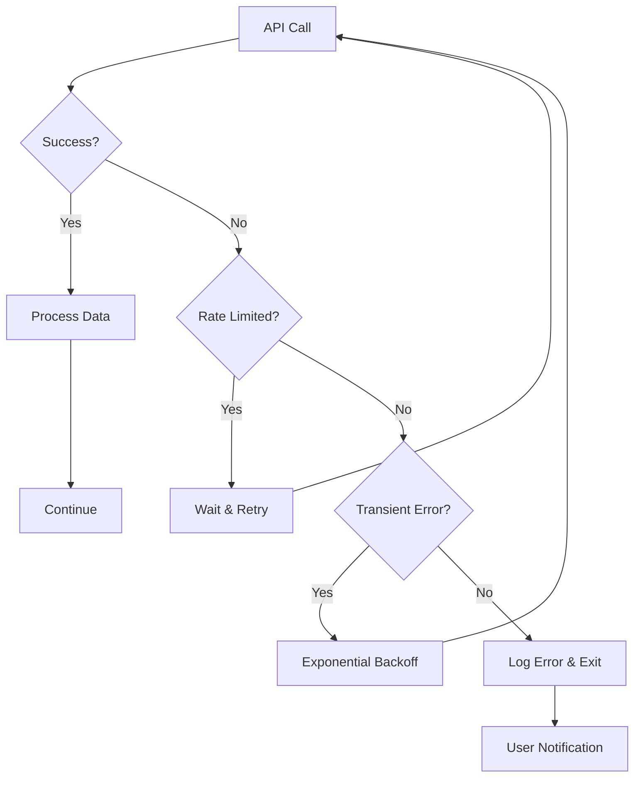

# DORA Metrics Back-Calculation Tool - 4+1 Architecture Document

## 1. Use Case View (Scenarios)

### Primary Actors
- **DevOps Engineer**: Runs the tool to calculate team metrics
- **Engineering Manager**: Reviews DORA metrics reports
- **CI/CD System**: Triggers incremental updates

### Key Use Cases

#### UC1: Initial Historical Data Extraction
```
Actor: DevOps Engineer
Goal: Extract all historical commit and PR data from repository
Preconditions: Repository exists, GitHub access configured
Flow:
1. Engineer runs `dora-metrics init` to set up configuration
2. Engineer runs `dora-metrics extract --full`
3. System extracts all commits from main branch
4. System fetches associated PRs, releases, and labels
5. System generates pending_review.csv for annotation
Postconditions: Raw data extracted and ready for review
```

#### UC2: Manual Data Annotation
```
Actor: DevOps Engineer
Goal: Annotate deployment events and incidents
Preconditions: pending_review.csv exists
Flow:
1. Engineer opens pending_review.csv in spreadsheet software
2. Engineer marks deployment commits (not captured by releases)
3. Engineer identifies hotfix PRs missed by labels
4. Engineer saves annotated file
5. Engineer runs `dora-metrics import annotations.csv`
Postconditions: Master dataset updated with annotations
```

#### UC3: Incremental Updates
```
Actor: CI/CD System
Goal: Keep metrics data current
Preconditions: Initial extraction completed
Flow:
1. Cron job runs `dora-metrics update` daily
2. System identifies new commits since last run
3. System fetches new PR and release data
4. System appends to pending_review.csv
5. System sends notification if manual review needed
Postconditions: Dataset updated with latest changes
```

#### UC4: Metrics Calculation and Reporting
```
Actor: Engineering Manager
Goal: View DORA metrics for specific time period
Preconditions: Annotated dataset exists
Flow:
1. Manager runs `dora-metrics report --period quarterly`
2. System calculates four key metrics
3. System generates HTML report with visualizations
4. Manager reviews trends and identifies improvements
Postconditions: Metrics report generated
```

## 2. Logical View (Design)

### Component Architecture



### Key Classes and Interfaces

```python
# Core Domain Models
@dataclass
class Commit:
    sha: str
    author: str
    date: datetime
    message: str
    files_changed: List[str]

@dataclass
class PullRequest:
    number: int
    title: str
    created_at: datetime
    merged_at: Optional[datetime]
    commits: List[str]
    labels: List[str]
    is_hotfix: bool

@dataclass
class Deployment:
    commit_sha: str
    deployed_at: datetime
    release_tag: Optional[str]
    is_rollback: bool

# Data Extractors
class GitExtractor:
    def extract_commits(self, repo_path: str, branch: str, since: datetime, until: datetime) -> List[Commit]:
        pass

class GitHubGraphQLClient:
    def get_pull_requests(self, repo: str, since: datetime, until: datetime) -> List[PullRequest]:
        """Fetch PRs using GraphQL for efficient pagination"""
        pass
    def get_releases(self, repo: str, since: datetime, until: datetime) -> List[Deployment]:
        """Fetch releases using GraphQL"""
        pass
    def get_pr_commits_batch(self, repo: str, pr_numbers: List[int]) -> Dict[int, List[str]]:
        """Batch fetch commit SHAs for multiple PRs in one query"""
        pass

# Storage Abstraction
class StorageManager:
    def __init__(self, storage_type: str = "local", bucket: Optional[str] = None):
        """Initialize with 'local' or 's3' storage"""
        pass
    
    def read(self, path: str) -> str:
        """Read file from local filesystem or S3"""
        pass
    
    def write(self, path: str, content: str) -> None:
        """Write file to local filesystem or S3"""
        pass
    
    def exists(self, path: str) -> bool:
        """Check if file exists"""
        pass
    
    def list(self, prefix: str) -> List[str]:
        """List files with given prefix"""
        pass

# Metrics Calculation Functions
def calculate_lead_time(data: pd.DataFrame, period: str) -> Dict[str, float]:
    pass

def calculate_deployment_frequency(data: pd.DataFrame, period: str) -> Dict[str, float]:
    pass

def calculate_change_failure_rate(data: pd.DataFrame, period: str) -> Dict[str, float]:
    pass

def calculate_mttr(data: pd.DataFrame, period: str) -> Dict[str, float]:
    pass
```

## 3. Process View (Runtime)

### Sequence Diagram: Full Extraction Flow



### State Machine: Data Lifecycle



## 4. Development View (Implementation)

### Package Structure



### Technology Stack

- **Language**: Python 3.9+
- **CLI Framework**: Click
- **Git Operations**: GitPython
- **GitHub API**: GraphQL via gql/httpx
- **Data Processing**: pandas, numpy
- **Testing**: pytest, pytest-mock
- **Storage**: JSON, CSV (local filesystem or S3)
- **Object Storage**: boto3 for S3-compatible storage

## 5. Physical View (Deployment)

### Deployment Options

#### Option 1: Local CLI Tool


#### Option 2: CI/CD Integration



### Data Flow Architecture



## +1 Scenarios (Cross-Cutting Concerns)

### Security Considerations
- GitHub token stored in environment variable or secure credential store
- Read-only access to repositories
- No sensitive data in CSV exports
- Audit logging for all data modifications

### Performance Optimization
- GraphQL API for efficient batch queries (fetch PRs, releases, and commits in minimal requests)
- Incremental extraction to minimize API calls (using raw JSON files to avoid re-fetching)
- Configurable rate limiting for GitHub API

### Error Handling Flow



### Monitoring and Observability
- Structured logging with levels
- Progress indicators for long operations

### Configuration Management

Configuration is handled via:
- CLI arguments for all parameters
- Environment variables for sensitive data:
  - `GITHUB_TOKEN` for GitHub API access
  - `AWS_ACCESS_KEY_ID` and `AWS_SECRET_ACCESS_KEY` for S3 (optional)
  - `DORA_STORAGE_TYPE` to specify 'local' or 's3' (defaults to 'local')
  - `DORA_S3_BUCKET` for S3 bucket name when using S3 storage