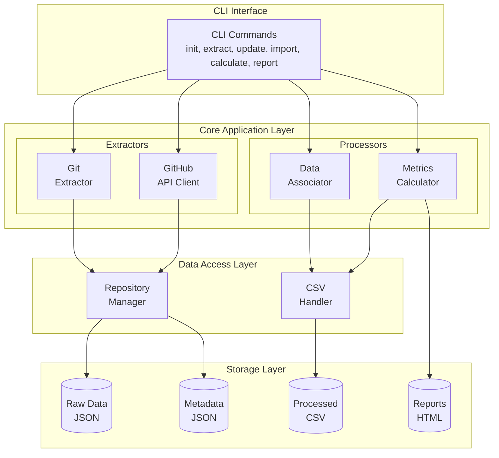
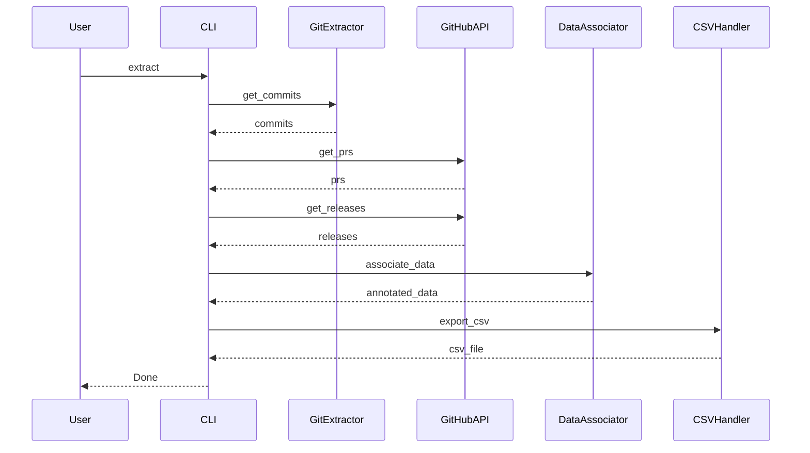
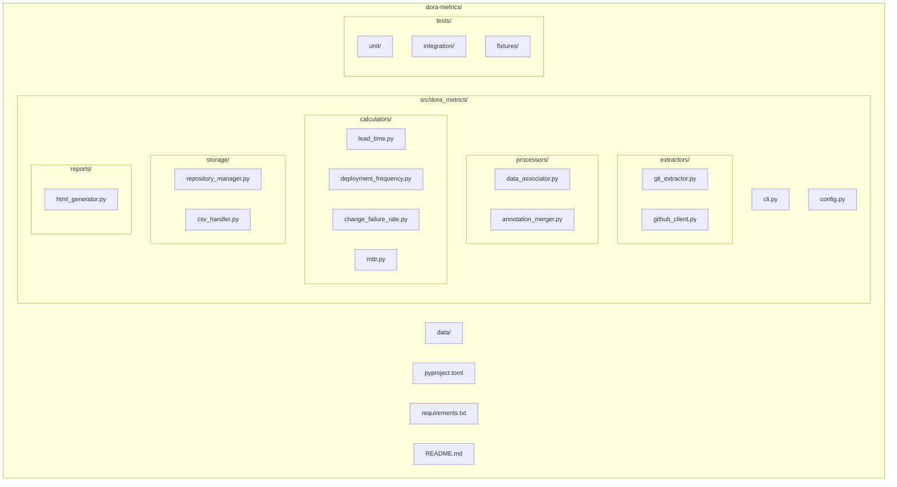
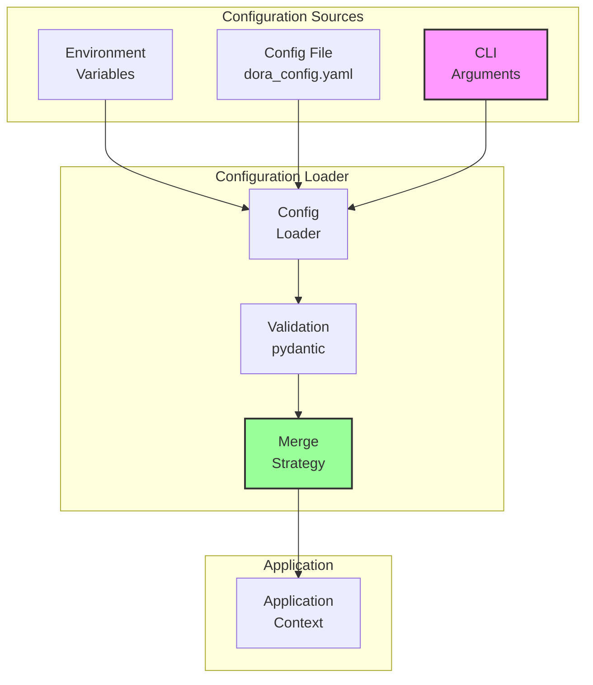

# DORA Metrics Back-Calculation Tool - 4+1 Architecture Document

## 1. Use Case View (Scenarios)

### Primary Actors
- **DevOps Engineer**: Runs the tool to calculate team metrics
- **Engineering Manager**: Reviews DORA metrics reports
- **CI/CD System**: Triggers incremental updates

### Key Use Cases

#### UC1: Initial Historical Data Extraction
```
Actor: DevOps Engineer
Goal: Extract all historical commit and PR data from repository
Preconditions: Repository exists, GitHub access configured
Flow:
1. Engineer runs `dora-metrics init` to set up configuration
2. Engineer runs `dora-metrics extract --full`
3. System extracts all commits from main branch
4. System fetches associated PRs, releases, and labels
5. System generates pending_review.csv for annotation
Postconditions: Raw data extracted and ready for review
```

#### UC2: Manual Data Annotation
```
Actor: DevOps Engineer
Goal: Annotate deployment events and incidents
Preconditions: pending_review.csv exists
Flow:
1. Engineer opens pending_review.csv in spreadsheet software
2. Engineer marks deployment commits (not captured by releases)
3. Engineer identifies hotfix PRs missed by labels
4. Engineer saves annotated file
5. Engineer runs `dora-metrics import annotations.csv`
Postconditions: Master dataset updated with annotations
```

#### UC3: Incremental Updates
```
Actor: CI/CD System
Goal: Keep metrics data current
Preconditions: Initial extraction completed
Flow:
1. Cron job runs `dora-metrics update` daily
2. System identifies new commits since last run
3. System fetches new PR and release data
4. System appends to pending_review.csv
5. System sends notification if manual review needed
Postconditions: Dataset updated with latest changes
```

#### UC4: Metrics Calculation and Reporting
```
Actor: Engineering Manager
Goal: View DORA metrics for specific time period
Preconditions: Annotated dataset exists
Flow:
1. Manager runs `dora-metrics report --period quarterly`
2. System calculates four key metrics
3. System generates HTML report with visualizations
4. Manager reviews trends and identifies improvements
Postconditions: Metrics report generated
```

## 2. Logical View (Design)

### Component Architecture



### Key Classes and Interfaces

```python
# Core Domain Models
@dataclass
class Commit:
    sha: str
    author: str
    date: datetime
    message: str
    files_changed: List[str]

@dataclass
class PullRequest:
    number: int
    title: str
    created_at: datetime
    merged_at: Optional[datetime]
    commits: List[str]
    labels: List[str]
    is_hotfix: bool

@dataclass
class Deployment:
    commit_sha: str
    deployed_at: datetime
    release_tag: Optional[str]
    is_rollback: bool

# Core Interfaces
class Extractor(ABC):
    def extract(self, since: datetime, until: datetime) -> List[Any]:
        pass

class MetricCalculator(ABC):
    def calculate(self, data: pd.DataFrame, period: str) -> Dict[str, float]:
        pass

# Concrete Implementations
class GitExtractor(Extractor):
    def extract_commits(self, branch: str) -> List[Commit]:
        pass

class GitHubAPIClient(Extractor):
    def get_pull_requests(self) -> List[PullRequest]:
        pass
    def get_releases(self) -> List[Deployment]:
        pass

class LeadTimeCalculator(MetricCalculator):
    def calculate(self, data: pd.DataFrame, period: str) -> Dict[str, float]:
        pass
```

## 3. Process View (Runtime)

### Sequence Diagram: Full Extraction Flow



### State Machine: Data Lifecycle


## 4. Development View (Implementation)

### Package Structure



### Technology Stack

- **Language**: Python 3.9+
- **CLI Framework**: Click
- **Git Operations**: GitPython
- **GitHub API**: PyGithub
- **Data Processing**: pandas, numpy
- **Configuration**: pydantic, PyYAML
- **Testing**: pytest, pytest-mock
- **Visualization**: matplotlib, plotly
- **Storage**: JSON, CSV

## 5. Physical View (Deployment)

### Deployment Options

#### Option 1: Local CLI Tool


#### Option 2: CI/CD Integration


#### Option 3: Containerized Service
```yaml
# docker-compose.yml
version: '3.8'
services:
  dora-metrics:
    build: .
    volumes:
      - ./data:/app/data
      - ${REPO_PATH}:/repo:ro
    environment:
      - GITHUB_TOKEN=${GITHUB_TOKEN}
    command: update
```

### Data Flow Architecture


## +1 Scenarios (Cross-Cutting Concerns)

### Security Considerations
- GitHub token stored in environment variable or secure credential store
- Read-only access to repositories
- No sensitive data in CSV exports
- Audit logging for all data modifications

### Performance Optimization
- Incremental extraction to minimize API calls
- Caching of GitHub API responses
- Batch processing for large repositories
- Configurable rate limiting

### Error Handling Flow


### Extensibility Points
- Plugin architecture for custom extractors
- Configurable metric calculations
- Support for non-GitHub repositories
- Custom report formats

### Monitoring and Observability
- Structured logging with levels
- Metrics export for monitoring systems
- Health check endpoint for service mode
- Progress indicators for long operations

### Configuration Management

